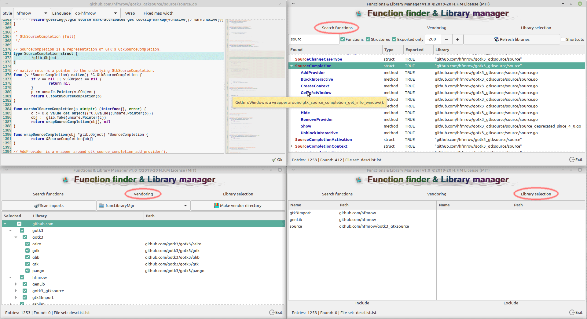

# Functions Library Manager v1.1.4

#### Last update 2021-04-02

*This program is designed for **Golang** users to **find** and **view** **functions**/**methods**/**structures** through defined libraries. It also allows you to create a vendor directory in a specified project.*

###### Why ?

> Just because I created a lot of libraries for my use and over time they grow a lot and now to quickly find the function I need and be able to integrate it into my project I needed to a tool allowing me to find it and thus know what were the necessary 'imports'. With this tool, I can do all of this quickly. I have also integrated the possibility of creating a 'vendor' directory that I use in most of the projects that I present in my 'repository'.

---

###### libgtksourceview-4-0 is required to work:

 (most Linux distributions include it natively)

```bash
$ sudo apt install libgtksourceview-4-0
```

> **Functions Library Manager** Debian package installation:
> 
> ```bash
> $ sudo dpkg -i go-func-lib-mgr-x.x-amd64.deb
> ```
> 
> Uninstall:
> 
> ```bash
> $ sudo dpkg -P go-func-lib-mgr
> ```

Take a look at [H.F.M repositories](https://github.com/hfmrow/) for others useful Linux software.

- If you just want **to use it**, simply **download** the **compiled version** ( .deb) under the [Releases](https://github.com/hfmrow/go-func-lib-mgr/releases) tab.

- Otherwise, if you plan to play inside the source code, see below "How to compile" section.

- All suggestions, contributions and ideas to improve software usability will be greatly appreciated.

### How it's made

- Programmed with go language: [golang](https://golang.org/doc/)
- GUI provided by [Gotk3](https://github.com/gotk3/gotk3), GUI library for Go (minimum required gtk3.16).
- Text editor use [GtkSourceView](https://github.com/hfmrow/gotk3_gtksource) component.
- I use home-made software: "Gotk3ObjHandler" to embed images/icons, UI-information and manage/generate gtk3 objects code from [glade ui designer](https://glade.gnome.org/). and "Gotk3ObjTranslate" to generate the language files and the assignment of a tool-tip on the gtk3 objects (both are not published at the moment, in fact, they need documentations and, I have not had the time to do them).

### Functionalities

- Search and display of *functions* / *methods* / *structures* exported or not, in selected local libraries.
- Creation of a "vendor" directory to facilitate future compilations of your projects without problem by copying all the libraries used in it, in this way, even if the libraries have changed (become incompatible) or disappeared, your program can still have access to it. Possibility to include (or not) the libraries according to your wishes.
- Allows you to preview the source code (which was found) with a highlight capability spanning multiple languages.
- A map that allows you to see all the content of the code found and allows easy navigation through it.
- Easily navigate to the **functions**/ **methods** /**structures** tree and simply display the "comment" it contains using the tooltip display.
- Each function have his tool-tip for explanations.

*This is the main screen, and children*



### How to compile

- Be sure you have golang installed in right way. [Go installation](https://golang.org/doc/install).

- Open terminal window and at command prompt, type: `go get github.com/hfmrow/go-func-lib-mgr`

- See [Gotk3 Installation instructions](https://github.com/gotk3/gotk3/wiki#installation) for gui installation instruction.

- [gotk3\_gtksource](https://github.com/hfmrow/gotk3_gtksource) is also required.

- To change gtk3 interface you need to use the ```devMode = true``` to disable embedding assets. see below ...

- To change language file you need to use another home made software, (not published actually). So don't change language file ...

- To Produce a **stand-alone executable**, you must change inside "main.go" file:

```go
    func main() {
        devMode = true
    ...    
```

into

```go
    func main() {
        devMode = false
    ...
```

This operation indicate that externals data (Image/Icons) must be embedded into the executable file.

## Os information:

<details>
  <summary>Built using</summary>

| Name                                                       | Version / Info / Name                          |
| ---------------------------------------------------------- | ---------------------------------------------- |
| GOLANG                                                     | V1.16.3 -> GO111MODULE="off", GOPROXY="direct" |
| DISTRIB                                                    | LinuxMint Xfce                                 |
| VERSION                                                    | 20                                             |
| CODENAME                                                   | ulyana                                         |
| RELEASE                                                    | #46-Ubuntu SMP Fri Jul 10 00:24:02 UTC 2020    |
| UBUNTU_CODENAME                                            | focal                                          |
| KERNEL                                                     | 5.8.0-48-generic                               |
| HDWPLATFORM                                                | x86_64                                         |
| GTK+ 3                                                     | 3.24.20                                        |
| GLIB 2                                                     | 2.64.3                                         |
| CAIRO                                                      | 1.16.0                                         |
| [GtkSourceView](https://github.com/hfmrow/gotk3_gtksource) | 4.6.0                                          |
| [LiteIDE](https://github.com/visualfc/liteide)             | 37.4 qt5.x                                     |
| Qt5                                                        | 5.12.8 in /usr/lib/x86_64-linux-gnu            |

</details>

- The compilation have not been tested under Windows or Mac OS, but all file access functions, line-end manipulations or charset implementation are made with OS portability in mind.

### You got an issue ?

- Go to this page: [Issues · hfmrow/go-func-lib-mgr · GitHub](https://github.com/hfmrow/go-func-lib-mgr/issues) and start a new problem report.
- Give the information (as above), concerning your working environment as well as the version of the operating system used.
- Provide a method to reproduce the problem.

### Used libraries

- [Golang GtkSourceView binding for use with gotk3](https://github.com/hfmrow/gotk3_gtksource)
- [Go bindings for GTK3](https://github.com/gotk3/gotk3)
- [fuzzy](https://github.com/sahilm/fuzzy)
- And some personal libraries not yet published.

### Visit

##### [hfmrow (H.F.M) / Repositories · GitHub](https://github.com/hfmrow?tab=repositories)

##### [Website H.F.M's Linux softwares](https://hfmrow.go.yo.fr/)
